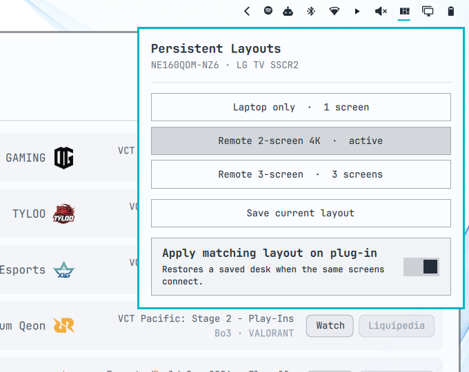

# Persistent Layouts



Save a Hyprland desk. Get it back when the same screens plug in.

Persistent Layouts is an [Omarchy](https://omarchy.org) bar widget for people who move between setups: laptop only, a dock at home, a TV on the road. It remembers each named layout and restores the matching one automatically.

Screens are matched by **make and model**, not `DP-3` / `HDMI-A-1`. Connector names renumber; the panel does not.

It is a profile switcher, not a spatial editor. Arrange the screens with HyprMon or `hyprctl`, then save. The widget applies what you saved.

Stock **Display** stays where it is (brightness, text size, scale). This chip uses a different icon on purpose.

No sudo or pkexec is required.

## How this is different

Other listed tools cover adjacent jobs:

- **Stock Display** — backlight, font size, scale, enable/disable
- **hyprmoncfg** — named profiles and a hotplug daemon, via an external TUI the bar launches
- **Screens / Display Manager** — in-bar visual editors that also save a desk

Persistent Layouts only switches named profiles. Geometry stays with whatever you already use to place monitors.

## Install

```sh
omarchy plugin add https://github.com/matt-shearing/omarchy-persistent-layouts.git --enable
```

That clones the plugin and can place the widget on the right side of the bar, next to Display.

## Use

- **Click** the chip — open the profile list
- **Right-click** — apply the profile that matches the connected screens
- **Save current layout** — snapshot mode, scale, and position for this set of panels
- **Apply matching layout on plug-in** — restore that snapshot when the same make/model set returns

The matching service retries after a display is added or removed, because some HDMI sinks take a few seconds to become ready.

## Profiles and config

User data lives outside the plugin folder and is not deleted on remove:

- Profiles: `~/.config/omarchy/persistent-layouts/profiles/`
- Auto-apply: `~/.config/omarchy/persistent-layouts/config.json`
- Active profile: `~/.local/state/omarchy/persistent-layouts/`

An older `~/.config/omarchy/display-profiles/` directory is copied on first run.

Applying a profile changes the live Hyprland layout. If `~/.config/hypr/hyprmon.lua` already exists, that file is refreshed so a HyprMon restart matches. `monitors.lua` is not edited.

## Command line

The bundled helper is invoked by the widget. From a checkout or an installed plugin folder:

```sh
bin/persistent-layouts status
bin/persistent-layouts list
bin/persistent-layouts save desk --name "Home desk"
bin/persistent-layouts apply desk
bin/persistent-layouts detect --apply
bin/persistent-layouts auto off
```

## Requirements

- Omarchy Quattro with third-party shell plugins
- Hyprland with `hyprctl`
- Python 3 (already on Omarchy)

## Remove

```sh
omarchy plugin remove contra.layouts
```

Saved profiles stay on disk. Delete `~/.config/omarchy/persistent-layouts/` only if you want those gone too.

## Development

```sh
python3 tests/test_cli.py
omarchy plugin validate .
```

## License

MIT. See [LICENSE](LICENSE).
